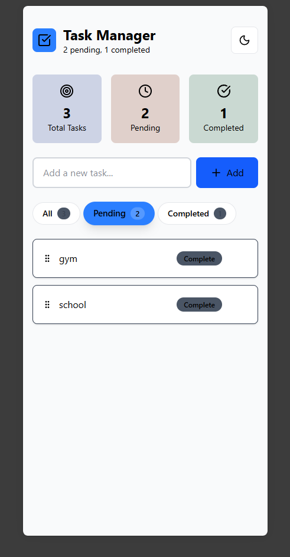
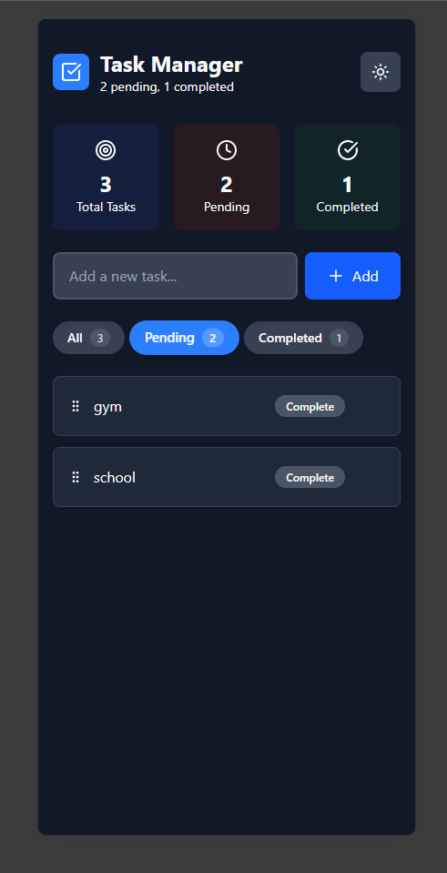

# Task Manager

A simple and elegant task management app built with React and Tailwind CSS. Add, complete, and organize your tasks with a clean interface that supports both light and dark themes.

## Screenshots

**Light Theme**


**Dark Theme**


## Quick Start

Install dependencies and run the development server:

```bash
npm install
npm run dev
```

Open http://localhost:5173 to view the app.

## Features

Add new tasks, mark them as complete, filter by status, and drag to reorder. Your tasks are automatically saved to local storage and the app includes a theme toggle for light and dark modes.

## Built With

React, Vite, Tailwind CSS, and Lucide React icons.